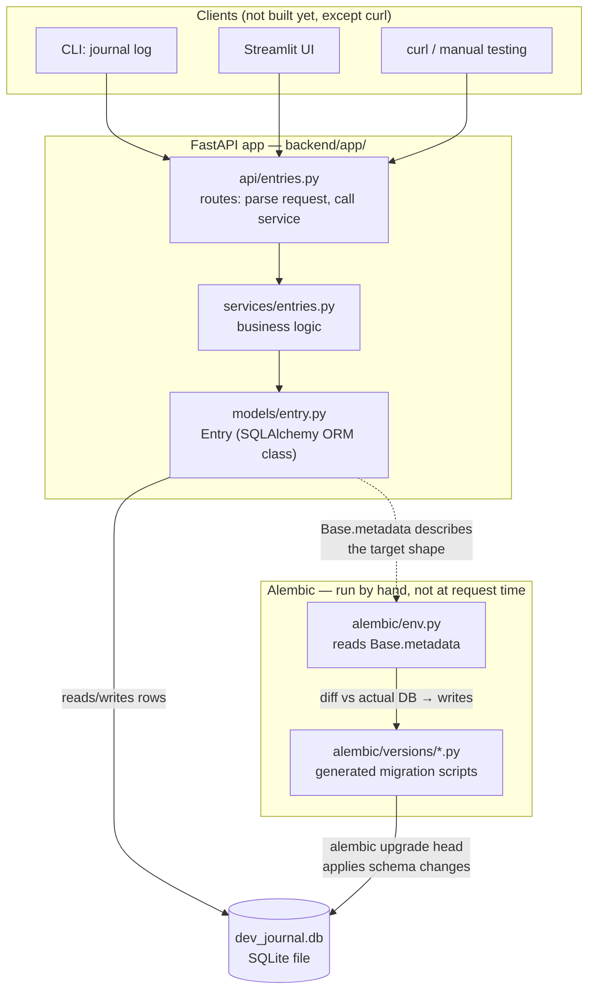
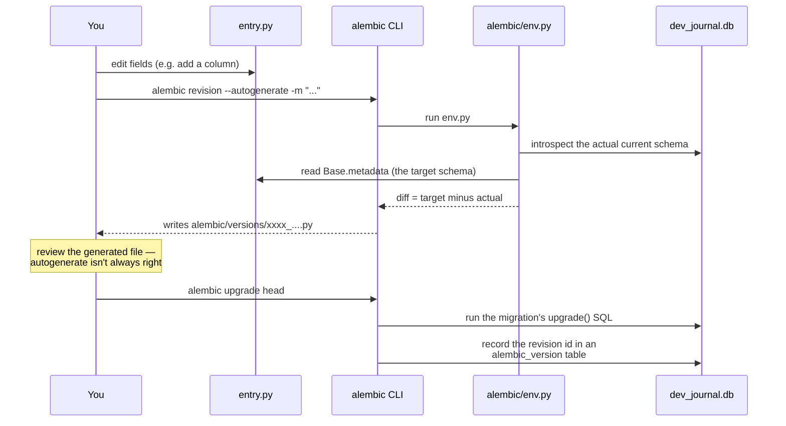
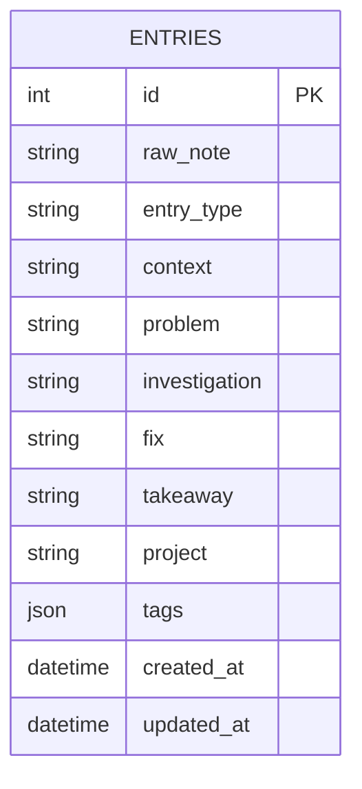

<!-- title: Backend Architecture -->

# dev-journal backend architecture

How a request flows through the app, and where Alembic sits relative to
everything else — read this before generating the first migration.

## 1. Where Alembic sits

The key thing to see: **Alembic is not part of the FastAPI app that runs
at request time.** It's a separate command-line tool you run by hand,
whose only job is comparing your Python model classes against the actual
database and writing/applying the SQL needed to reconcile them.

Notice `Model` connects to `DB` two different ways: the FastAPI app talks
to the database to read/write **rows** (normal request traffic); Alembic
talks to the same database to change the **shape of the table itself**
(columns, types, indexes). Two different concerns, two different tools,
same underlying `.db` file.

## 2. What actually happens when you run the two Alembic commands

Two commands, two distinct jobs:

- **`alembic revision --autogenerate`** only *writes a file* — it never
  touches your real database. It's the "diff" step: compare what the
  models say (`Base.metadata`) against what the database currently has,
  and generate Python code (`upgrade()`/`downgrade()` functions) that
  would reconcile them.
- **`alembic upgrade head`** is the step that actually *runs* that SQL
  against the database. `head` means "the most recent migration in the
  chain" — Alembic tracks migrations like a linked list, each one
  pointing at the one before it.

## 3. How Alembic knows what's already applied

The database itself gets one extra table you didn't define:
`alembic_version`. It holds exactly one row — the ID of the last
migration that was applied. That's the entire mechanism: `alembic
upgrade head` walks forward through any migrations newer than that ID;
`alembic downgrade <id>` walks backward, running each migration's
`downgrade()` function in reverse. This is why migrations are often
described as "version control for your schema" — each file is a
commit, `alembic_version` is your current `HEAD`.

## 4. The table this first migration will create

This is what `alembic revision --autogenerate` is about to detect as
"missing" (the database currently has no tables at all) and write a
`CREATE TABLE entries (...)` migration for.

## Glossary

- **Migration** — one Python file describing a schema change, with an
  `upgrade()` and a `downgrade()` function.
- **Revision** — a migration's unique ID (a short hash), used to order
  the chain and to record progress in `alembic_version`.
- **Autogenerate** — Alembic's diffing feature; convenient but not
  infallible (it can miss renames, some constraint changes) — hence
  reviewing the file before applying it.
- **`head`** — the newest revision in the chain; `alembic upgrade head`
  means "bring the database fully up to date."
